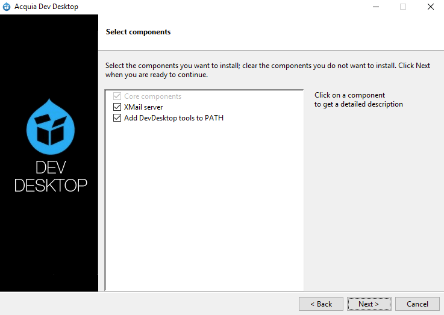

Installeer Drupal op je computer
================================
Om Drupal te kunnen gebruiken op je eigen computer of laptop zijn er een aantal
stappen nodig:

1. Er moeten een webserver en databaseserver op je systeem geïnstalleerd worden.
2. De Drupal 8 bestanden moeten geïnstalleerd worden.
3. Drupal 8 moet zijn eigen database installeren.

We werken bij *Drupal in a Day* met de *Acquia Dev Desktop*. In dit hoofdstuk
vind je instructies voor het installeren van de Dev Desktop op zowel Windows als
Mac. Maak je gebruik van een ander systeem, bijv. Linux, dan kun je gewoon
meedoen met het cursusgedeelte van *Drupal in a Day*, maar je bent wel op jezelf
aangewezen voor het installeren van de benodigde software. Grofweg zijn de
bovenstaande drie stappen hetzelfde. Heb je eenmaal een webserver en database
draaiend en heb je de Drupal-distributie voor *Drupal in a Day* gedownload, dan
zijn de stappen voor het installeren van Drupal ook gelijk en kun je verder bij
de sectie [Drupal downloaden en klaarmaken voor installatie](#drupal-downloaden-en-klaarmaken-voor-installatie).

Ook als je wel een Mac of Windows-machine hebt, maar gebruik maakt van een 
andere oplossing om PHP-sites te draaien, dan kun je daar in principe gebruik 
van maken. Echter ben je ook dan op jezelf aangewezen bij eventuele problemen 
die daaruit voortvloeien. Het is het overwegen waard om Dev Desktop naast je 
eigen oplossing te installeren. Dev Desktop installeert zijn componenten op een 
aparte locatie en gebruikt geen standaard poorten, dus het is goed mogelijk om 
het te installeren naast andere oplossingen.

De Acquia Dev Desktop kun je downloaden op de [download-pagina van het Acquia
Developer Center](https://dev.acquia.com/downloads). Kies voor *Mac Download* of
*Win Download*, afhankelijk van het systeem waar je het op gaat installeren.

Web server en database installeren
--------------------
Hieronder vind je het installatieproces van de Acquia Dev Desktop voor Mac en 
Windows. De installatieprocedure is vrijwel gelijk voor Mac en Windows. Als er 
afwijkingen zijn zullen we die benoemen. De screenshots zijn gemaakt op een Mac
die draait op macOS High Sierra. Gebruik je een andere versie, of gebruik je 
Windows, dan zullen de schermen er iets anders uit zien.
 
### Starten van de Installer
De eerste stappen om de installatie te starten zijn op Mac en Windows iets 
anders. 

#### Mac
Als de download klaar is open je het bestand (disk image).

Dubbelklik nu op het blauwe icoontje genaamd *Acquia Dev Desktop Installer* om 
de installer te starten.

Waarschijnlijk krijg je nu een waarschuwing te zien dat het bestand afkomstig
is van een voor Apple onbekende ontwikkelaar.

Krijg je deze waarschuwing te zien, dan klik je deze eerst weg door op *OK* te 
klikken. Hierna open je *Systeemvoorkeuren*
(*System Preferences*), bijvoorbeeld door te klikken op het Apple-logo 
linksboven in de menu-balk en de betreffende optie te kiezen in het dropdown 
menu. Hier kies je voor *Veiligheid & Privacy* (*Security &
Privacy*).

Daar vind je je onder het tabje *Algemeen* (*General*) een tekst
die aangeeft dat Acquia Dev Desktop geblokkeerd is. Ernaast staat een
knop om de installer alsnog te starten. Klik op die knop.

Je krijgt nu nogmaals een waarschuwing, maar nu kun je *Open* kiezen. Je Mac zal 
je enkele keren vragen om je wachtwoord om de Installer op te slaan als 
goedgekeurd programma. Hierna zal de installer starten.

Klik op *Next* om de installatie te starten. 

#### Windows
Als de download klaar is open je de installer (als je er niet voor gekozen hebt
om de installer meteen te starten bij het downloaden). Waarschijnlijk krijg je 
eerst een waarschuwing te zien met de vraag of de installer wijzigingen mag 
aanbrengen aan je systeem.

Antwoord met ja. De installer zal je nu vragen welke componenten je wilt 
installeren.

Je kunt dit zo laten staan. Klik op *Next*. 

### Vervolg van de installatie
#### Mac en Windows
Zowel op Mac als op Windows krijg je nu een samenvatting te zien
van de software die op je computer geïnstalleerd gaat worden.

Ga verder door op *Next* te klikken.

De installer toont de algemene voorwaarden en geeft je de keuze om wel of niet
data omtrend het gebruik van de Dev Desktop te delen met Acquia. Die keuze is
aan jou!

Als je gekozen hebt, kan je *Next* klikken om verder te gaan.

Je krijgt nu je de mogelijkheid om de locatie van de installatiebestanden te 
kiezen (screenshot voor Mac, op Windows wijken de locaties af).

Laat de standaard-instellingen staan, tenzij je een andere voorkeur hebt 
(en je weet wat je doet). Kies daarna weer voor *Next* om verder te gaan.

Vervolgens wordt je gevraagd welke poorten er gebruikt mogen worden voor de
webserver en de database.

Ook hier geldt dat de standaard instellingen overgenomen kunnen worden als je 
geen speciale reden hebt om ze aan te passen. Klik op *Next* om verder te gaan.

De installer toon nog een laatste keer een overzicht van je keuzes.

Als ze goed staan kan je op *Next* klikken om verder te gaan. 

De Dev Desktop installer is nu helemaal klaar om te gaan installeren.

Klik op *Next* om het installeren te starten.

Pak iets te drinken terwijl je computer druk bezig is met installeren.

Het is zover! De Dev Desktop is op je computer geïnstalleerd. Klik het vinkje 
**uit** waar *Launch Acquia Dev Desktop after clicking Finish* bij staat, want we 
gaan eerst Drupal zelf downloaden.

Drupal downloaden en klaarmaken voor installatie
-----------------
Nu de webserver en database op je systeem geïnstalleerd zijn, moeten we de 
bestanden van Drupal op je computer gaan zetten. De Dev Desktop biedt de 
mogelijkheid om dit voor je te doen voor de standaard versie van Drupal en voor
een aantal populaire *distributies*. Voor *Drupal in a Day* maken we gebruik van 
een aparte distributie. Deze gaan we nu downloaden.

Ga naar [https://github.com/drupalinaday/did-training-distro](https://github.com/drupalinaday/did-training-distro).

TODO. Localiseren van de laatste versie op Github of misschien Drupal in a 
Day-site.
 
Download de laatste versie in zip-formaat en pak deze uit. Verplaats de 
uitgepakte naar een locatie waar de webserver ze kan vinden, in een aparte 
directory. Als je gebruik maakt van de Acquia Dev Desktop en de standaard 
locaties hebt gebruikt dan zal dat bijvoorbeeld zijn: 

* /Users/(jouw account)/Sites/devdesktop/drupalinaday op Mac
* C:\\???\devdesktop\drupalinaday op Windows

Start nu de Acquia Dev Desktop. 

* Op de Mac kun je deze vinden in de map *Applicaties* (*Applications*) onder 
*DevDesktop*.
* Op Windows kun je deze vinden ...

***Maak je geen gebruik van de Dev Desktop**, zorg er dan voor dat je een lokale 
website hebt die de directory waar de Drupal-bestanden staan als web root 
gebruikt. Maak ook een database aan voor gebruik met de Drupal-installatie. Je 
kunt dan verder gaan met de stap [Drupal installeren](#drupal-installeren).*

De screenshots tonen de Mac-versie, maar de stappen zijn in principe gelijk voor 
de Windows-versie. Nadat je de Dev Desktop hebt gestart krijg je het volgende 
scherm te zien:

Kies voor de tweede optie; *Start with an existing Drupal site located on my 
computer*.

In het scherm dat je te zien krijgt klik je rechts naast het veld *Local 
codebase folder* op *Change...*. Je kiest nu de locatie uit waar je de 
Drupal-bestanden hebt neergezet. Dev Desktop vult nu een aantal velden in aan de 
hand van je keuze.

* Kies als PHP-versie 7.0. Voor de PHP-versie zie je drie getallen, bijvoorbeeld 
  7.0.14. Het laatste getal, de zogenaamde patch versie, maakt hierbij niet 
  zoveel uit. Is er geen 7.0-variant beschikbaar, dan is een hogere versie 
  (bijv. 7.1 of 7.2) ook goed.
* Controleer dat bij Database staat *Create a new database*.

Klik op OK. Het kan zijn dat je Mac vraagt om je wachtwoord. Dit is omdat het 
hosts bestand aangepast moet worden, zodat je browser de lokale Drupal-website 
kan vinden.

Het is gelukt! De website staat klaar voor jou om ermee aan de slag te
gaan. Klik op het linkje bij *Local site* om aan het laatste onderdeel van de
installatie te beginnen.

Drupal installeren
-----------------------
De Drupal 8 bestanden staan nu op je computer. Het laatste wat moet gebeuren is
de installatie van Drupal zelf. Hierbij wordt de database gevuld met de 
benodigde tabellen en instellingen. Dat gaan we nu doen. Als je de link in de 
Dev Desktop hebt aangeklikt opent je webbrowser zich en verschijnt de
installatie-pagina van Drupal.

Kies hier jouw taal en klik op *Save and Continue*.

**Belangrijk.** Als je een andere taal dan Engels kiest, dan moet je zorgen dat 
je systeem een actieve internet-verbinding heeft zodat het de juiste vertaling 
kan downloaden.

TODO. Stap om profiel te kiezen, of profiel forceren in installatie. Evt. hier
nog een opmerking dat op deze plek in de installatie Drupal meestal vraagt om 
een profiel te kiezen.

De installatie wordt nu gestart.

Nadat de installatie enige tijd gedraaid heeft wil het installatie-script een 
aantal instellingen weten om de installatie te kunnen voltooien. 

De laatste stap voor je aan de slag kan. Vul hier alle gegevens voor je website
in.

* Kies een naam voor je website, bijv. *Drupal in a Day*.
* Stel een email-adres in. Dit is het email-adres dat gebruikt zou worden bij 
  het versturen van geautomatiseerde emails, je kunt hier je eigen email-adres 
  voor gebruiken. Er moet wel een geldig email-adres ingevuld worden, of 
  tenminste iets dat daarop lijkt. Pas op met "flauwekul" adressen, want het zal 
  je verbazen welke domeinen er allemaal geregistreerd zijn en welke 
  email-adressen dus potentieel echt bestaan. 
* Stel een gebruikersnaam in voor de beheerdersaccount die automatisch wordt 
  aangemaakt, bijv. *admin*.
* Kies een wachtwoord dat je makkelijk kunt onthouden, bijv. *password*. Het 
  hoeft geen veilig wachtwoord te zijn, want de site is alleen toegankelijk op 
  je eigen computer. *Houdt er rekening mee dat je wel een sterk wachtwoord 
  instelt als je de site ooit online zou zetten.*
* Noteer gebruikersnaam en wachtwoord ergens zodat je deze niet vergeet. Met
  extra tools is het mogelijk om weer toegang te krijgen tot een Drupal-site 
  waarvan de gegevens van het beheerdersaccount kwijt zijn, maar die hebben we
  hier niet beschikbaar.

Klik op *Opslaan en doorgaan* (*Save and Continue*) om af te ronden en je eigen Drupal website te zien.

Gefeliciteerd, Drupal is geïnstalleerd, je kan aan de slag. Ga naar [stap 1 van de
basiscursus]() om aan de slag te gaan!
