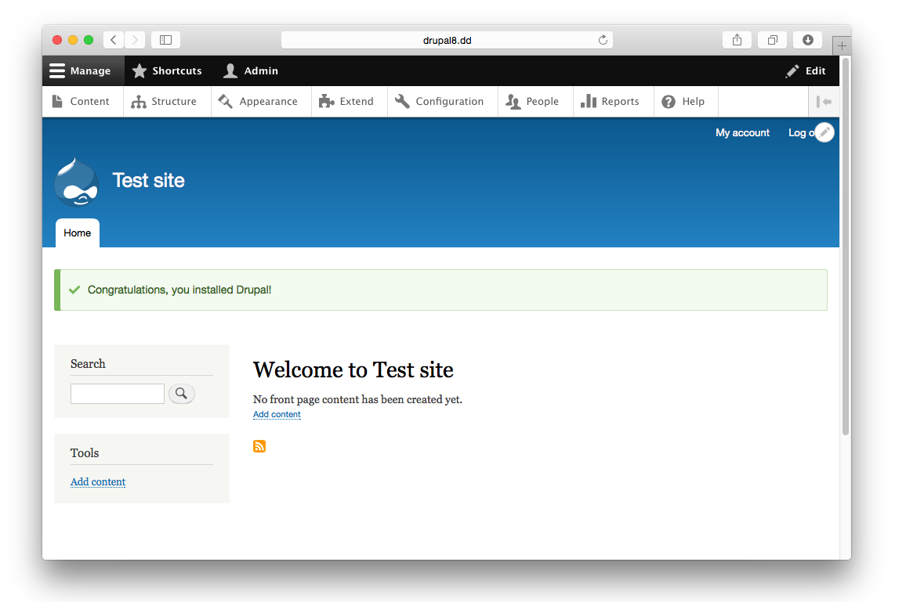

Installeer Drupal op je computer
================================
Om Drupal te kunnen gebruiken op je eigen computer of laptop zijn er een aantal
stappen nodig:

1. Er moeten een webserver en databaseserver op je systeem geïnstalleerd worden.
2. De Drupal 8 bestanden moeten geïnstalleerd worden.
3. Drupal 8 moet zijn eigen database installeren.

We werken bij *Drupal in a Day* met de *Acquia Dev Desktop*. In dit hoofdstuk
vind je instructies voor het installeren van de Dev Desktop op zowel Windows als
Mac. Maak je gebruik van een ander systeem, bijv. Linux, dan kun je gewoon
meedoen met het cursusgedeelte van *Drupal in a Day*, maar je bent wel op jezelf
aangewezen voor het installeren van de benodigde software. Grofweg zijn de
bovenstaande drie stappen hetzelfde. Heb je eenmaal een webserver en database
draaiend en heb je de Drupal-distributie voor *Drupal in a Day* gedownload, dan
zijn de stappen voor het installeren van Drupal ook gelijk en kun je verder bij
de sectie [Drupal installeren](#drupal-installeren).

De Acquia Dev Desktop kun je downloaden op de [download-pagina van het Acquia
Developer Center](https://dev.acquia.com/downloads). Kies voor *Mac Download* of
*Win Download*, afhankelijk van het systeem waar je het op gaat installeren.

Web server en database installeren
--------------------
### Mac
Als de download klaar is open je op het bestand (disk image). Dubbelklik nu op 
het blauwe icoontje genaamd *Acquia Dev Desktop Installer* om de installer te 
starten:

Waarschijnlijk krijg je nu een foutmelding te zien omdat het bestand afkomstig 
is van een voor Apple onbekende ontwikkelaar.

Krijg je deze foutmelding te zien, dan klik je deze eerst weg door op *OK* te 
klikken. Hierna open je *Systeemvoorkeuren*
(*System Preferences*). Hier kies je voor *Veiligheid & Privacy* (*Security &
Privacy*).

Daar vind je je onder het tabje *Algemeen* (*General*) een tekst
die aangeeft dat Acquia Dev Desktop geblokkeerd is. Ernaast staat een
knop om de installer alsnog te starten. Klik op die knop.

Je krijgt nu normaals een waarschuwing, maar nu kun je *Open* kiezen. Je Mac zal 
je enkele keren vragen om je wachtwoord om de Installer op te slaan als 
goedgekeurd programma. Hierna zal de installer starten.

Klik op *Next* om de installatie te starten. Je krijgt een samenvatting te zien 
van de software die op je computer geïnstalleerd gaat worden. Ga verder door op 
*Next* te klikken.

De installer toont de algemene voorwaarden en geeft je de keuze om wel of niet
data omtrend het gebruik van de Dev Desktop te delen met Acquia. Die keuze is
aan jou! Als je gekozen hebt, kan je *Next* klikken om verder te gaan.

Je krijgt nu je de mogelijkheid om de locatie van de installatiebestanden te 
kiezen. Laat de standaard-instellingen staan, tenzij je een andere voorkeur hebt 
(en je weet wat je doet). Kies daarna weer voor *Next* om verder te gaan.

Vervolgens wordt je gevraagd welke poorten er gebruikt mogen worden voor de
webserver en de database. Ook hier geldt dat de standaard instellingen 
overgenomen kunnen worden als je geen speciale reden hebt om ze aan te passen.
Klik op *Next* om verder te gaan.

De installer toon nog een laatste keer een overzicht van je keuzes. Als ze goed 
staan kan je op *Next* klikken om verder te gaan. 

De Dev Desktop installer is nu helemaal klaar om te gaan installeren. Klik op
*Next* om het installeren te starten.

Pak iets te drinken terwijl je computer druk bezig is met installeren.

Het is zover! De Dev Desktop is op je computer geïnstalleerd. Klik op *Finish*
om de Dev Desktop op te starten en ga door met het tweede deel van de
installatiehandleiding om je eigen Drupal 8 site te installeren.

### Windows
TODO.

Drupal-distributie kiezen
-----------------------
Nu de webserver en database op je systeem geïnstalleerd zijn, volgen de
stappen om een Drupal 8 website te installeren op je systeem. De screenshots
tonen de Mac-versie, maar de stappen zijn in principe gelijk voor de Windows-
versie. Als je de Dev Desktop nog niet opgestart had, doe dat dan nu. Je krijgt 
het volgende scherm te zien:

Omdat we nog geen Drupal 8 website hebben, kiezen we hier voor de eerste optie
om deze te installeren; *Start from scratch, I don't have an existing Drupal site*.

In de lijst die je vervolgens te zien krijgt, kies je *Drupal 8* en klik je op
*install*.

Het kan zijn de de versie bij jou anders is dan hier afgebeeld, dat is niet erg.

Geef je nieuwe Drupal website een naam. Je kan 'drupal-8-2-6' laten staan, maar
kan hier ook je eigen site naam opgeven. (Dit mag je ook voor de database doen,
maar let op dat je alleen gewone tekens gebruikt en geen spaties). Klik op
*Finish* als je klaar bent om verder te gaan.

Yes! Het is gelukt! De website staat klaar voor jou om ermee aan de slag te
gaan. Klik op het linkje bij *Local site* om aan het laatste onderdeel van de
installatie te beginnen&hellip;

De installatie - deel 3
-----------------------
De Drupal 8 bestanden staan nu op je computer. Het laatste wat moet gebeuren is
dat Drupal zichzelf installeert. Dat gaan we nu doen. Als je de link in de Dev
Desktop hebt aangeklikt opent je webbrowser zich en verschijnt de Drupal
installatie pagina.

Kies hier jouw taal en klik op *Save and Continue*.

**Belangrijk**: als je een andere taal kiest, moet je zorgen dat jouw systeem
een actieve internet verbinden heeft zodat het de juiste vertaling kan
downloaden.

Drupal gaat aan de slag om zichzelf te installeren&hellip;

De laatste stap voor je aan de slag kan. Vul hier alle gegevens voor je website
in. In de cursus leggen we uit hoe je deze informatie later kan aanpassen.

Klik op *Finish* om af te ronden en je eigen Drupal website te zien.

Et Voila! Drupal 8 is geïnstalleerd. Je kan aan de slag. Ga naar [stap 1 van de
basiscursus]() om aan de slag te gaan!
