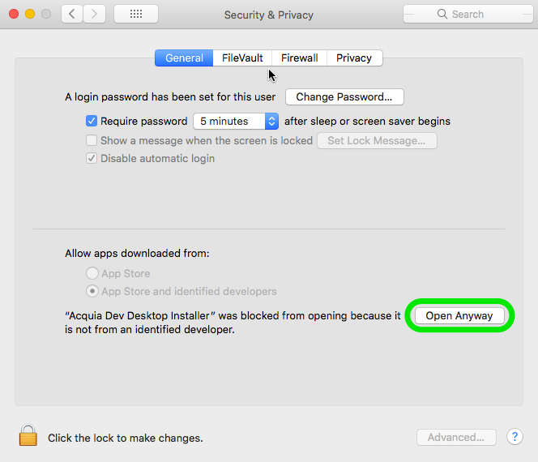
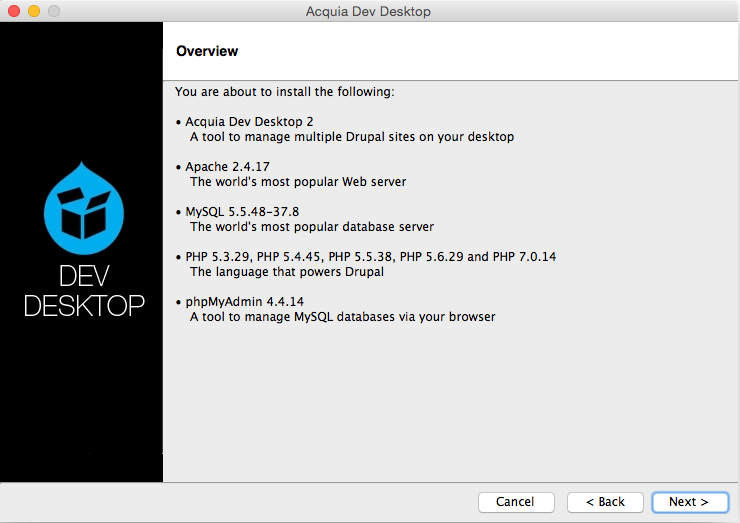
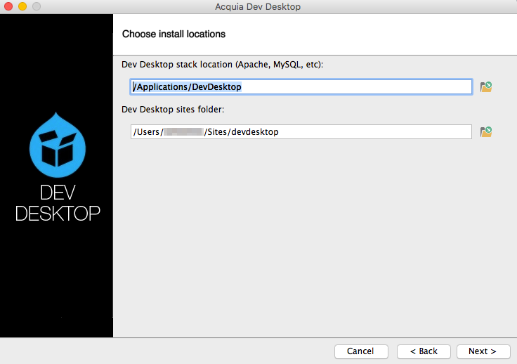
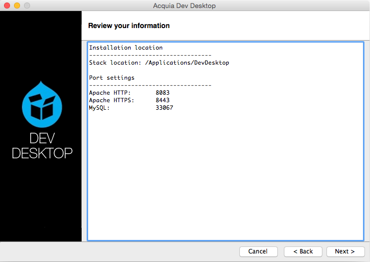
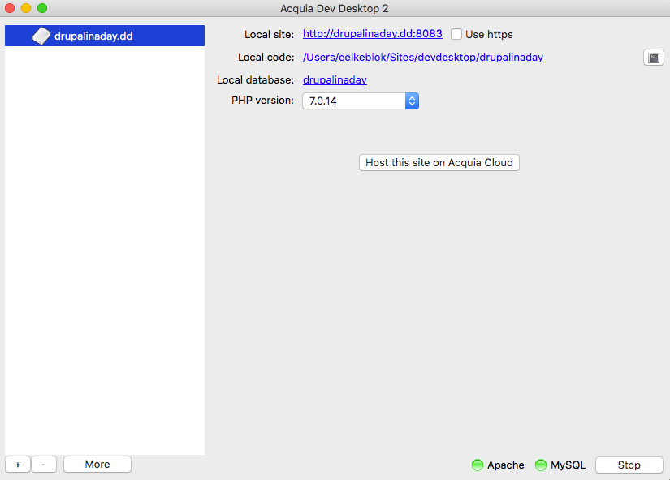

Installeer Drupal op je computer
================================
Dit is de installatiehandleiding voor de Acquia Dev Desktop op een mac. Heb je 
Windows, dan kan je [hier]() terecht. De installatie verloopt in drie stappen:

1. De bestanden van de server moeten op je systeem geïnstalleerd worden.
2. De Drupal 8 bestanden moeten geïnstalleerd worden.
3. Drupal 8 moet zijn eigen database files installeren.

Om te beginnen moet je de Dev Desktop downloaden van de Acquia website. Dit doe 
je via de volgende link:

[https://dev.acquia.com/downloads](https://dev.acquia.com/downloads)

Kies voor 'Download win' en als het bestand is gedownload.

Installeren - deel 1
--------------------
Eerst gaan we de Dev Desktop op je computer installeren zodat de webserver en de 
databaseserver op je systeem komen te staan. Je kan het installatiebestand wat 
je net gedownload hebt, starten (dubbelklik op het blauwe icoontje genaamd 
*Acquia Dev Desktop Installer*):

Het kan zijn dat je daarop een foutmelding te zien krijgt en dat jouw mac het 
bestand niet wil openen&hellip;
 

Open dan *Privacy & security* in *System preferences* (je komt daar door op het 
Appeltje bovenaan te klikken en dan *System Preferences* te klikken). Daar kan 
je onder het tabje Algemeen/General de instelling veranderen om hem te openen.

De installatie is klaar om te starten! Klik op *Next* om aan de slag te gaan.

Je krijgt een samenvatting te zien van de bestanden die op je computer 
geïnstalleerd gaan worden. Ga verder door op *Next* te klikken.

De installer toont de algemene voorwaarden en geeft je de keuze om wel of niet 
data omtrent het gebruik van de Dev Desktop te delen met Acquia. Die keuze is 
aan jou! Als je gekozen hebt, kan je *Next* klikken om verder te gaan!

Hier kan je aangeven waar dat de installer de files moet plaatsen op je 
computer. Dit kan je naar wens aanpassen. Kies daarna weer voor *Next* om 
verder te gaan.
 

Vervolgens wordt je gevraagd welke poorten er gebruikt mogen worden voor de 
webserver en de database. Deze staan goed ingevuld, als je echter weet wat je 
doet mogen ze hier uiteraard aangepast worden. Klik op *Next* om verder te gaan. 

De Dev Desktop toont nogmaals de poorten. Als ze goed staan kan je op *Next* 
klikken om verder te gaan.

De Dev Desktop installer is nu helemaal klaar om te gaan installeren. Klik op 
*Next* om het installeren te starten!

Pak iets te drinken terwijl je computer druk bezig is met installeren&hellip;

Het is zover! De Dev Desktop is op je computer geïnstalleerd. Klik op *Finish*
om de Dev Desktop op te starten en ga naar deel 2 van de installatiehandleiding 
om je eigen Drupal 8 site te installeren....

De installatie - deel 2
-----------------------
Nu alles (de webserver en database) op je systeem geïnstalleerd is, volgen de 
stappen om een Drupal 8 website te installeren op je systeem&hellip; Als je de 
Dev Desktop nog niet opgestart had, doe dat dan nu! Je krijgt het volgende 
scherm te zien:

Omdat we nog geen Drupal 8 website hebben, kiezen we hier voor de eerste optie 
om deze te installeren.

In de lijst die je vervolgens te zien krijgt, kies je *Drupal 8* en klik je op 
*install*. 

Het kan zijn de de versie bij jou anders is dan hier afgebeeld, dat is niet erg.

Geef je nieuwe Drupal website een naam. Je kan 'drupal-8-2-6' laten staan, maar 
kan hier ook je eigen site naam opgeven. (Dit mag je ook voor de database doen, 
maar let op dat je alleen gewone tekens gebruikt en geen spaties). Klik op 
*Finish* als je klaar bent om verder te gaan.

Yes! Het is gelukt! De website staat klaar voor jou om ermee aan de slag te 
gaan. Klik op het linkje bij *Local site* om aan het laatste onderdeel van de 
installatie te beginnen&hellip;

De installatie - deel 3
-----------------------
De Drupal 8 bestanden staan nu op je computer. Het laatste wat moet gebeuren is 
dat Drupal zichzelf installeert. Dat gaan we nu doen. Als je de link in de Dev 
Desktop hebt aangeklikt opent je webbrowser zich en verschijnt de Drupal 
installatie pagina.

Kies hier jouw taal en klik op *Save and Continue*.

**Belangrijk**: als je een andere taal kiest, moet je zorgen dat jouw systeem 
een actieve internet verbinden heeft zodat het de juiste vertaling kan 
downloaden.

Drupal gaat aan de slag om zichzelf te installeren&hellip;
 

De laatste stap voor je aan de slag kan. Vul hier alle gegevens voor je website 
in. In de cursus leggen we uit hoe je deze informatie later kan aanpassen.

Klik op *Finish* om af te ronden en je eigen Drupal website te zien.

Et Voila! Drupal 8 is geïnstalleerd. Je kan aan de slag. Ga naar [stap 1 van de
basiscursus]() om aan de slag te gaan!
